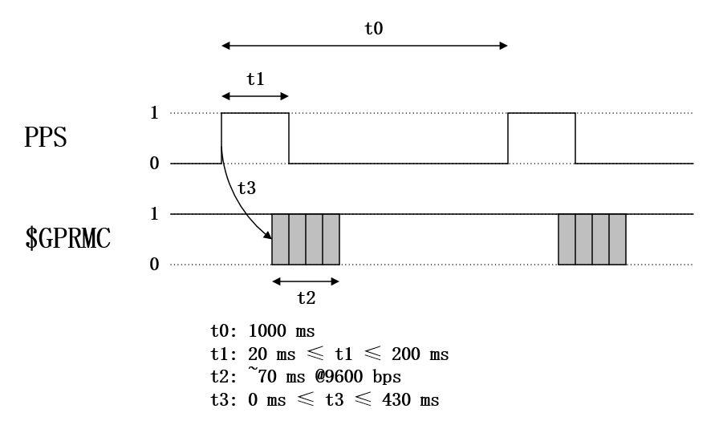

**Livox SDK Communication Protocol**

| **Document Release History** |             |                                                              |
| ---------------------------- | ----------- | ------------------------------------------------------------ |
| **Date**                     | **Release** | **Change Description**                                       |
| 2019/10/22                   | v1.1.1      | 1. Update status code, add time synchronization status (Horizon: v06.05.00.00+, Mid-40/Mid-100: v03.07.00.00+)  2. Change IMU data push frequency |
| 2019/9/25                    | v1.1.0      | 1. Add Tele-15 / Horizon LiDAR's support                     |
| 2019/7/08                    | v1.0.6      | 1. Fix crc32 bits error  2. Add system status code description |
| 2019/5/17                    | v1.0.5      | Fix partial description errors                               |
| 2019/4/18                    | v1.0.4      | 1. Update motor status code (v03.05.00.00+)  2. Add query Hub slot power status command (v08.05.00.00+) |
| 2019/4/17                    | v1.0.3      | Update Hub read LiDAR extrinsic parameters description       |
| 2019/3/25                    | v1.0.2      | Update 3.2 Time Stamp description                            |
| 2019/2/25                    | v1.0.1      | Update 3.2 Time Stamp description                            |
| 2019/1/16                    | v1.0.0      | Initial release                                              |

# 1 Summary

## 1.1 Data Class

There are two types of communication between the user and LiDAR unit(s), and the
protocol formats of these two kinds of data are different. The specific functions 
and differences are as follows:

> - **Control Command Data**: Configuration and query of LiDAR parameters and status
information;
> - **Sample Data**: Sample data generated by LiDAR units including point cloud data and IMU data(Not supported by MID40/100);
At present, both protocols are encapsulated in the data segment of the UDP
package, and the data format in protocol is stored in little-endian form.

## 1.2 Mode and State Description

The mode in which the user can switch LiDAR:

When the user sets LiDAR mode and the mode switching is completed, the LiDAR
unit(s) will be in the corresponding state:

# 2 Control Command

## 2.1 Frame Format

The Protocol Frame is the smallest unit for control command. Format is as
follows:

| Field    | Index (byte) | Size (byte) | Description                                 |
|----------|--------------|-------------|---------------------------------------------|
| sof      | 0            | 1           | Starting Byte, Fixed to be 0xAA             |
| version  | 1            | 1           | Protocol Version, 1 for The Current Version |
| length   | 2            | 2           | Length of The Frame, Max Value: 1400        |
| cmd_type | 4            | 1           | Command Type:  0x00: CMD  0x01: ACK  0x02: MSG |
| seq_num  | 5            | 2           | Frame Sequence Number                       |
| crc_16   | 7            | 2           | Frame Header Checksum                       |
| data     | 9            | n           | Payload Data                                |
| crc_32   | 9+n          | 4           | Whole Frame Checksum                        |

Command type description:
> - **CMD (request)**: Actively send data request - need to return a corresponding ACK;
> - **ACK (response)**: Response to CMD data;
> - **MSG (message)**: Actively pushed message data - no need to return response data,

> e.g. broadcast data, pushed message when an error occurs;

Initial value of the CRC check:

| crc16 initial value | crc32 initial value |
|---------------------|---------------------|
| 0x4c49              | 0x564f580a          |

## 2.2 Frame Data

### 2.2.1 Data Segment Format

Data segment format in Protocol Frame:

| Field    | Index (byte) | Size (byte) |
|----------|--------------|-------------|
| cmd_set  | 0            | 1           |
| cmd_id   | 1            | 1           |
| cmd_data | 2            | Vary by cmd |

### 2.2.2 CMD Set & CMD ID

There are three kinds of CMD sets:
> - **General Command Set**: All of Livox Device support General Command Set including Livox LiDAR and Livox Hub.
> - **LiDAR Command Set**: Only Livox LiDAR supports LiDAR Command Set.
> - **Hub Command Set**: Only Livox Hub supports Hub Command Set.

| CMD Set                  | CMD ID | Function                                            |
| ------------------------ | ------ | --------------------------------------------------- |
| 0x00 General Command Set | 0x00   | Broadcast Message                                   |
|                          | 0x01   | Handshake                                           |
|                          | 0x02   | Query Device Information                            |
|                          | 0x03   | Heartbeat                                           |
|                          | 0x04   | Start/Stop Sampling                                 |
|                          | 0x05   | Change Coordinate System                            |
|                          | 0x06   | Disconnect                                          |
|                          | 0x07   | Push Abnormal Status Information                    |
|                          | 0x08   | Configure Static/Dynamic IP                         |
|                          | 0x09   | Get Device IP Information                           |
|                          | 0x0A   | Reboot device                                       |
| 0x01 LiDAR Command Set   | 0x00   | Set Mode                                            |
|                          | 0x01   | Write LiDAR Extrinsic Parameters                    |
|                          | 0x02   | Read LiDAR Extrinsic Parameters                     |
|                          | 0x03   | Turn On/Off Rain/Fog Suppression                    |
|                          | 0x04   | Set Turn On/Off Fan                                 |
|                          | 0x05   | Get Turn On/Off Fan State                           |
|                          | 0x06   | Set LiDAR Return Mode                               |
|                          | 0x07   | Get LiDAR Return Mode                               |
|                          | 0x08   | Set IMU Data Push Frequency                         |
|                          | 0x09   | Get IMU Data Push Frequency                         |
|                          | 0x0A   | Update UTC synchronization time                     |
| 0x02 Hub Command Set     | 0x00   | Query Connected LiDAR Device                        |
|                          | 0x01   | Set LiDAR Mode                                      |
|                          | 0x02   | Turn On/Off Designated Slot Power                   |
|                          | 0x03   | Write LiDAR Extrinsic Parameters                    |
|                          | 0x04   | Read LiDAR Extrinsic Parameters                     |
|                          | 0x05   | Query LiDAR Device Status                           |
|                          | 0x06   | Turn On/Off Hub Calculation of Extrinsic Parameters |
|                          | 0x07   | Turn On/Off LiDAR Rain/Fog Suppression              |
|                          | 0x08   | Query Hub Slot Power Status                         |
|                          | 0x09   | Set LiDAR Turn On/Off Fan                           |
|                          | 0x0A   | Get LiDAR Turn On/Off Fan State                     |
|                          | 0x0B   | Set LiDAR Return Mode                               |
|                          | 0x0C   | Get LiDAR Return Mode                               |
|                          | 0x0D   | Set LiDAR IMU Data Push Frequency                   |
|                          | 0x0E   | Get LiDAR IMU Data Push Frequency                   |
## 2.3 SDK Connection

In the process of communication, LiDAR or Hub are defined as slave, and the
computer which receives point cloud data is defined as master.
The communication flow between master and slave is as follows:
1. When the slave is powered on, it broadcasts the device information data to
port 55000 of the master using source port 65000;
2. After receiving the broadcast data, the master sends a connection request to
the slave port 65000, which contains the source port information;
3. The slave replies ACK data to this source port after receiving the master's
connection request;
4. When the user receives ACK data, the handshake is completed. It can start
sending heartbeat data to maintain the connection, and transmit commands and
data.

**NOTE**: *The Livox LiDAR/Hub will re-broadcast if heartbeat is timeout.*

Flow Chart:

# 3 Sample Data Package

## 3.1 Package Format

Point cloud data format output by LiDAR:

| Field          | Index (byte) | Size (byte) | Description                                           |
|----------------|--------------|-------------|-------------------------------------------------------|
| version        | 0            | 1           | Packet Protocol Version, 5 for the Current Version    |
| slot_id        | 1            | 1           | ID of the Slot Connecting LiDAR Device:  If LiDAR connects directly to computer without Hub, default 1;  If LiDAR connects to computer through Hub,  then the ‘slot_id’ is the corresponding slot number of the hub (range: 1 ~ 9); |
| LiDAR_id       | 2            | 1           | LiDAR ID:  1: Mid-100 Left / Mid-40 / Tele-15 / Horizon  2: Mid-100 Middle  3: Mid-100 Right             |
| reserved       | 3            | 1           |                                                       |
| status_code    | 4            | 4           | LiDAR Status Indicator Information, For details, see 3.4 |
| timestamp_type | 8            | 1           | Timestamp Type, For details, see [3.2](#timestamp)       |
| data_type      | 9            | 1           | Data Type, For details, see [3.3](#data_type)            |
| timestamp      | 10           | 8           | Nanosecond or UTC Format Timestamp, For details, see 3.2 |
| data           | 18           | --          | Data information, For details, see [3.3](#data_type)     |

## 3.2 Time Stamp {#timestamp}
LiDAR system supports three synchronization modes: 
- PTP: IEEE 1588v2.0 PTP network protocol synchronization.
- GPS: In order to synchronize with GPS, LiDAR/Hub have to receive PPS and UTC timestamps. For Horizon and Tele-15, LiDAR unit can receive UTC timestamps in control command over Ethernet. Livox Hub unit can receive UTC timestamps in $GPRMC message over RS485 serial port.
- PPS: Pulse synchronization (only supported by LiDAR).

**Synchronization Priority:** PTP > GPS > PPS, when there are multiple synchronization sources in the system, the synchronization mode with the highest priority will be selected. If the highest priority synchronization source is offline, the timestamp type will continue to be maintained and will not fall back to the lower priority, and `time_sync_status` in [Status Code](# 3.5.1 LiDAR Status Code) will be set to 4(the highest priority synchronization signal is abnormal).

Each packet contains a timestamp indicating the time of the first point in the packet.The time interval of each point in the packet is equal.  

Taking Mid-40 as an example, the sampling frequency is 100 KHz , and the interval of each point is 10 us.

| Point NUM | Timestamp  |
| --------- | ---------- |
| 1         | T1         |
| 2         | T1 + 10 us |
| 3         | T1 + 20 us |
| ...       | ...        |
| 100       | T1 + 990us |

Timestamp Type:

| Timestamp Type | Source         | Data Type | Description                       |
| -------------- | -------------- | --------- | --------------------------------- |
| 0              | No sync source | uint64_t  | Unit: ns                          |
| 1              | PTP            | uint64_t  | Unit: ns                          |
| 2              | Reserved       |           |                                   |
| 3              | GPS            | UTC       | UTC                               |
| 4              | PPS            | int64_t   | Unit: ns, only supported by LiDAR |

**Timestamp Type 0** 

When there is no synchronization signal in the system, the time stamp indicates
the time when device is powered on.

**Timestamp Type 1**

IEEE 1588v2.0 PTP network protocol synchronization 1588 network synchronization
mode has the highest priority.

**Timestamp Type 3**

A timestamp of 3 indicates LIDAR/Hub unit is sync with GPS. For LiDAR unit, PPS in RS485 level and UTC timestamp through SDK control command (refer to [**Update UTC synchronization time**](#_0xA_Update_UTC) for details) are needed. The sequence diagram is as follows:

For Livox Hub unit, PPS and $GPRMC message in RS485 level are needed. The sequence
diagram is as follows:

An example $GPRMC message is shown below:
$GPRMC,123519,A,4807.038,N,01131.000,E,022.4,084.4,230394,003.1,W*6A

| 123519    | Fix taken at 12:35:19 UTC                |
|-----------|------------------------------------------|
| A         | Status A=active or V=Void.               |
| 4807.038  | Current Latitude                         |
| N         | North/South                              |
| 01131.000 | Current Longitude                        |
| E         | East/West                                |
| 022.4     | Speed in knots                           |
| 084.4     | True course                              |
| 230394    | Date stamp, 23rd of March 1994           |
| 003.1     | Magnetic Variation                       |
| W         | West/East                                |
| *6A       | The checksum data, always begins with *  |

The timestamp in cloud point data package UTC time format:

| Byte 0 | Byte 1 | Byte 2 | Byte 3 | Byte 4 ~ 7                      |
|--------|--------|--------|--------|----------------------------------|
| Year   | Month  | Day    | Hour   | Offset within the Hour, Unit: us |

**Timestamp Type 4**

PPS synchronization source, using the RS485 level. The sequence diagram is as follows. The rising edge of PPS will reset the timestamp to zero. So the timestamp of point cloud data indicates the offset between the point cloud sampling and the PPS rising edge. In the case of IMU packets, the time offset may be negative due to the compensation delay.

## 3.3 Point Cloud/IMU Data {#data_type}
There are N samples in each data package. N depends on the user's configuration. The sample data can be one of the following formats.

Data Type:

| Data Type |Sample   Type        |Return Mode        | Coordinate Format |N| Data Frequency | Supported Devices |
|----------------|-------------------|-------------------|--------------------|------------------|-------------------|-------------------|
| 0              |Point Cloud Data |Single Return Mode |Cartesian Coordinate | 100                | 100,000 points/s  |Mid-40 |
| 1              |Point Cloud Data |Single Return Mode |Spherical Coordinate |100                | 100,000 points/s  |Mid-40                |
| 2             |Point Cloud Data |Single Return Mode |Cartesian Coordinate |96                 | 240,000 points/s  |Horizon Tele-15                     |
| 3              |Point Cloud Data |Single Return Mode |Spherical Coordinate |96                 | 240,000 points/s  |Horizon Tele-15   |
| 4              |Point Cloud Data   |Dual Return Mode   |Cartesian Coordinate |48                 | 480,000 points/s  |Horizon Tele-15                    |
| 5              |Point Cloud Data   |Dual Return Mode   |Spherical Coordinate |48                 | 480,000 points/s  |Horizon Tele-15                    |
| 6              |IMU Data           |---           |---             |1                  | see [IMU Data Push Frequency](#imu_freq) |Horizon Tele-15         |

**Data Type 0**

Single return cartesian coordinate data format:

| Field        | Offset (byte) | Data Type | Description      |
|--------------|---------------|-----------|------------------|
| x            | 0             | int32_t   | X axis, Unit: mm |
| y            | 4             | int32_t   | Y axis, Unit: mm |
| z            | 8             | int32_t   | Z axis, Unit: mm |
| reflectivity | 12            | uin8_t    | Reflectivity     |

**Data Type 1**

Single return spherical coordinate data format:

| Field        | Offset (byte) | Data Type | Description                               |
|--------------|---------------|-----------|-------------------------------------------|
| depth        | 0             | uint32_t  | Depth, Unit: mm                           |
| theta        | 4             | uint16_t  | Zenith angle[0, 18000], Unit: 0.01 degree |
| phi          | 6             | uin16_t   | Azimuth[0, 36000], Unit: 0.01 degree      |
| reflectivity | 8             | uin8_t    | Reflectivity                              |

**Data Type 2**

Single return cartesian coordinate data format:

| Field        | Offset (byte) | Data Type | Description      |
|--------------|---------------|-----------|------------------|
| x            | 0             | int32_t   | X axis, Unit: mm |
| y            | 4             | int32_t   | Y axis, Unit: mm |
| z            | 8             | int32_t   | Z axis, Unit: mm |
| reflectivity | 12            | uin8_t    | Reflectivity     |
| tag          | 13            | uint8_t   | For details, see [tag information](#tag_info)|

**Data Type 3**

Single return spherical coordinate data format:

| Field        | Offset (byte) | Data Type | Description                               |
|--------------|---------------|-----------|-------------------------------------------|
| depth        | 0             | uint32_t  | Depth, Unit: mm                           |
| theta        | 4             | uint16_t  | Zenith angle[0, 18000], Unit: 0.01 degree |
| phi          | 6             | uin16_t   | Azimuth[0, 36000], Unit: 0.01 degree      |
| reflectivity | 8             | uin8_t    | Reflectivity                              |
| tag          | 9             | uint8_t   | For details, see [tag information](#tag_info)|

**Data Type 4**

Dual return Cartesian coordinate data format:

| Field        | Offset (byte) | Data Type | Description      |
|--------------|---------------|-----------|------------------|
| x1            | 0             | int32_t   | X axis, Unit: mm |
| y1            | 4             | int32_t   | Y axis, Unit: mm |
| z1            | 8             | int32_t   | Z axis, Unit: mm |
| reflectivity1 | 12            | uin8_t    | Reflectivity     |
| tag1          | 13            | uint8_t   | For details, see [tag information](#tag_info)|
| x2            | 14            | int32_t   | X axis, Unit: mm |
| y2            | 18            | int32_t   | Y axis, Unit: mm |
| z2            | 22            | int32_t   | Z axis, Unit: mm |
| reflectivity2 | 26            | uin8_t    | Reflectivity     |
| tag2          | 27            | uint8_t   | For details, see [tag information](#tag_info)|

**Data Type 5**

Dual return spherical coordinate data format:

| Field        | Offset (byte) | Data Type | Description                               |
|--------------|---------------|-----------|-------------------------------------------|
| theta        | 0             | uint16_t  | Zenith angle[0, 18000], Unit: 0.01 degree |
| phi          | 2             | uin16_t   | Azimuth[0, 36000], Unit: 0.01 degree      |
| depth1       | 4             | uint32_t  | Depth, Unit: mm                           |
| reflectivity1| 8             | uin8_t    | Reflectivity                              |
| tag1         | 9             | uint8_t   | For details, see [tag information](#tag_info)|
| depth2       | 10            | uint32_t  | Depth, Unit: mm                           |
| reflectivity2| 14            | uin8_t    | Reflectivity                              |
| tag2         | 15            | uint8_t   | For details, see [tag information](#tag_info)|

**Data Type 6**

IMU data format:

| Field        | Offset (byte) | Data Type | Description                               |
|--------------|---------------|-----------|-------------------------------------------|
| gyro_x       | 0             | float     | Unit: rad/s                               |
| gyro_y       | 4             | float     | Unit: rad/s                               |
| gyro_z       | 8             | float     | Unit: rad/s                               |
| acc_x        | 12            | float     | Unit: g                                   |
| acc_y        | 16            | float     | Unit: g                                   |
| acc_z        | 20            | float     | Unit: g                                   |

## 3.4 Tag Information {#tag_info}

| Bit  | Description                                                  |
| ---- | ------------------------------------------------------------ |
| 7:6  | Reserved                                                     |
| 5:4  | Return Number:  00: Return 0 01: Return 1 02: Return 2 03: Return 4 |
| 3:2  | Point property based on return intensity:  00: Normal 01: High confidence level of the noise 02: Moderate confidence level of the noise 03: Reserved |
| 1:0  | Point property based on spatial position: 0: Normal  1: High confidence level of the noise 2: Moderate confidence level of the noise 3: Low confidence level of the noise |

> For details, see Livox Horizon/Tele-15 user manual.

## 3.5 Status Code

### 3.5.1 LiDAR Status Code

LiDAR status_code consists of 32 bits, which has the following meanings:

| Bits     | Data             | Description                                                  |
| -------- | ---------------- | ------------------------------------------------------------ |
| Bit0:1   | temp_status      | 0: Temperature in Normal State  1: High or Low  2: Extremely High or Extremely Low |
| Bit2:3   | volt_status      | Voltage Status of Internal Module  0: Voltage in Normal State  1: High  2: Extremely High |
| Bit4:5   | motor_status     | 0: Motor in Normal State  1: Motor in Warning State  2: Motor in Error State, Unable to Work |
| Bit6:7   | dirty_warn       | 0: Not Dirty or Blocked  1: Dirty or Blocked              |
| Bit8     | firmware_status  | 0: Firmware is OK  1: Firmware is Abnormal, Need to be Upgraded |
| Bit9     | pps_status       | 0: No PPS Signal  1: PPS Signal is OK                     |
| Bit10    | device_status    | 0: Normal  1: Warning for Approaching the End of Service Life |
| Bit11    | fan_status       | 0: Fan in Normal State  1: Fan in Warning State **Supported devices:**  Mid-40/03.07.0000+  Horizon/06.04.0000+  Tele-15/07.03.0000+ |
| Bit12    | self_heating     | 0: Low Temperature Self Heating On 1: Low Temperature Self Heating Off **Supported devices:**  Horizon/06.04.0000+  Tele-15/07.03.0000+ |
| Bit13    | ptp_status       | 0: No 1588 Signal  1: 1588 Signal is OK                   |
| Bit14:16 | time_sync_status | 0: System dose not start time synchronization  1: Using PTP 1588 synchronization  2: Using GPS synchronization  3: Using PPS synchronization  4: System time synchronization is abnormal (The highest priority synchronization signal is abnormal) |
| Bit17:29 | RSVD             |                                                              |
| Bit30:31 | system_status    | 0: Normal  1: Warning  Any of the following situations will trigger warning:    1.1 `temp_status` is 1;   1.2 `volt_status` is 1;   1.3 `motor_status` is 1;   1.4 `dirty_warn` is 1;   1.5 `device_status` is 1;    1.6 `fan_status` is 1; 2: Error  Causes the LiDAR to Shut Down and Enter the Error State.  Any of the following situations will trigger error:    2.1 `temp_status` is 2;   2.2 `volt_status` is 2;   2.3 `motor_status` is 2;   2.4 `firmware_status` is 1; |

### 3.5.2 Hub Status Code

Hub Status Code consists of 32 bits, which has the following meanings:

| Bits     | Data              | Description                                                  |
| -------- | ----------------- | ------------------------------------------------------------ |
| Bit0:1   | sync_status       | 0: No synchronization signal  1: 1588 synchronization  2: GPS synchronization 3: System time synchronization is abnormal (The highest priority synchronization signal is abnormal) |
| Bit2:3   | temp_status       | 0: Temperature in Normal State  1: High or Low  2: Extremely High or Extremely Low |
| Bit4     | LiDAR_status      | 0: LiDAR State is Normal  1: LiDAR State is Abnormal      |
| Bit5     | LiDAR_link_status | 0: LiDAR Connection is Normal  1: LiDAR Connection is Abnormal |
| Bit6     | firmware_status   | 0: LiDAR Firmware is OK  1: LiDAR Firmware is Abnormal, Need to be Upgraded |
| Bit7:29  | RSVD              |                                                              |
| Bit30:31 | system_status     | 0: Normal  1: Warning  Any of the following situations will trigger warning:   1.1 `temp_status` is 1; 2: Error  Any of the following situations will trigger error:    2.1 `temp_status` is 2;   2.2 `LiDAR_status` is 1;   2.3 `firmware_status` is 1; |

# 4 Control Command Detail
## 4.1 General CMD Set
### 0x00 Broadcast Message

message

| MSG  | Name             | Offset (byte) | Data Type   | Description           |
|------|------------------|---------------|-------------|-----------------------|
| data | cmd_set          | 0             | uint8_t     | General Command: 0x00 |
|      | cmd_id           | 1             | uint8_t     | Command ID: 0x00 |
|      | broadcast_code   | 2             | uint8_t[16] | Device Broadcast Code, C-Style string end with '\\0'  The Broadcast Code of Each Device is UNIQUE. |
|      | dev_type         | 18            | uint8_t     | Device Type:  0: Livox Hub  1: Mid-40  2: Tele-15  3: Horizon  |
|      | reserved         | 19            | uint16_t    | Reserved                                                   |

### 0x01 Handshake

request

| CMD  | Name      | Offset (byte) | Data Type  | Description                                                  |
| ---- | --------- | ------------- | ---------- | ------------------------------------------------------------ |
| data | cmd_set   | 0             | uint8_t    | General Command: 0x00                                        |
|      | cmd_id    | 1             | uint8_t    | Command ID: 0x01                                             |
|      | user_ip   | 2             | uint8_t[4] | Host IP Address  Example: AA.BB.CC.DD  user_ip[0] = AA  user_ip[1] = BB  user_ip[2] = CC  user_ip[3] = DD |
|      | data_port | 6             | uint16_t   | Host Point Cloud Data UDP Destination Port                   |
|      | cmd_port  | 8             | uint16_t   | Host Control Command UDP Destination Port                    |
|      | imu_port  | 10            | uint16_t   | Host Control IMU UDP Destination Port, **Supported Devices:** Horizon/06.04.0000+  Tele-15/07.03.0000+ |

response

| ACK  | Name     | Offset (byte) | Data Type | Description                           |
|------|----------|---------------|-----------|---------------------------------------|
| data | cmd_set  | 0             | uint8_t   | General Command: 0x00                 |
|      | cmd_id   | 1             | uint8_t   | Command ID: 0x01                      |
|      | ret_code | 2             | uint8_t   | Return Code:  0x00: Success  0x01: Fail |

### 0x02 Query Device Information

request

| CMD  | name    | Offset (byte) | Data Type | Description           |
|------|---------|---------------|-----------|-----------------------|
| data | cmd_set | 0             | uint8_t   | General Command: 0x00 |
|      | cmd_id  | 1             | uint8_t   | Command ID: 0x02      |

response

| ACK  | Name     | Offset (byte) | Data Type  | Description               |
|------|----------|---------------|------------|---------------------------|
| data | cmd_set  | 0             | uint8_t    | General Command: 0x00     |
|      | cmd_id   | 1             | uint8_t    | Command ID: 0x02          |
|      | ret_code | 2             | uint8_t    | Return Code:  0x00: Success  0x01: Fail|
|      | version  | 3             | uint8_t[4] | Firmware Version:  Example: AA.BB.CC.DD  version[0] = AA  version[1] = BB  version[2] = CC  version[3] = DD |

### 0x03 Heartbeat

The host needs to send request data at a frequency of 1 Hz to maintain normal
connection with the device.

request

| CMD  | Name    | Offset (byte) | Data Type | Description           |
|------|---------|---------------|-----------|-----------------------|
| data | cmd_set | 0             | uint8_t   | General Command: 0x00 |
|      | cmd_id  | 1             | uint8_t   | Command ID: 0x03      |

response

| ACK  | Name        | Offset (byte) | Data Type | Description      |
|------|-------------|---------------|-----------|------------------|
| data | cmd_set     | 0             | uint8_t   | General Command: 0x00    |
|      | cmd_id      | 1             | uint8_t   | Command ID: 0x03         |
|      | ret_code    | 2             | uint8_t   | Return Code:  0x00: Success  0x01: Fail |
|      | work_state  | 3             | uint8_t   | LiDAR State:  0x00: Initializing  0x01: Normal  0x02: Power-Saving  0x03: Standby  0x04: Error  Hub State:  0x00: Initializing  0x01: Normal  0x04: Error |
|      | feature_msg | 4             | uint8_t   | LiDAR Feature Message:  Bit0: Rain/Fog Suppression Switch  0x00: Turn Off  0x01: Turn On  Bit1 ~ Bit7: Reserved  **Hub is Reserved**               |
|      | ack_msg     | 5             | uint32_t  | ACK Message:  Related to ‘work_state’:  work_state is 0x00: Initialization Progress  work_state is other: Status Code                               |

### 0x04 Start/Stop Sampling

request

| CMD  | Name        | Offset (byte) | Data Type | Description                                  |
| ---- | ----------- | ------------- | --------- | -------------------------------------------- |
| data | cmd_set     | 0             | uint8_t   | General Command: 0x00                        |
|      | cmd_id      | 1             | uint8_t   | Command ID: 0x04                             |
|      | sample_ctrl | 2             | uint8_t   | 0x00: Stop Sampling  0x01: Start Sampling |

response

| ACK  | Name     | Offset (byte) | Data Type | Description                           |
|------|----------|---------------|-----------|---------------------------------------|
| data | cmd_set  | 0             | uint8_t   | General Command: 0x00                 |
|      | cmd_id   | 1             | uint8_t   | Command ID: 0x04                      |
|      | ret_code | 2             | uint8_t   | Return Code:  0x00: Success  0x01: Fail |

### 0x05 Change Coordinate System

request

| CMD  | Name            | Offset (byte) | Data Type | Description                                           |
|------|-----------------|---------------|-----------|-------------------------------------------------------|
| data | cmd_set         | 0             | uint8_t   | General Command: 0x00                                 |
|      | cmd_id          | 1             | uint8_t   | Command ID: 0x05                                      |
|      | coordinate_type | 2             | uint8_t   | 0x00: Cartesian Coordinate  0x01: Spherical Coordinate |

response

| ACK  | Name     | Offset (byte) | Data Type | Description                           |
|------|----------|---------------|-----------|---------------------------------------|
| data | cmd_set  | 0             | uint8_t   | General Command: 0x00                 |
|      | cmd_id   | 1             | uint8_t   | Command ID: 0x05                      |
|      | ret_code | 2             | uint8_t   | Return Code:  0x00: Success  0x01: Fail |

**NOTE:**  *This cmd only takes effect in RAM, the coordinate system will reset to Cartesian after reboot .*

### 0x06 Disconnect

request

| CMD  | Name    | Offset (byte) | Data Type | Description           |
|------|---------|---------------|-----------|-----------------------|
| data | cmd_set | 0             | uint8_t   | General Command: 0x00 |
|      | cmd_id  | 1             | uint8_t   | Command ID: 0x06      |

response

| ACK  | Name     | Offset (byte) | Data Type | Description                           |
|------|----------|---------------|-----------|---------------------------------------|
| data | cmd_set  | 0             | uint8_t   | General Command: 0x00                 |
|      | cmd_id   | 1             | uint8_t   | Command ID: 0x06                      |
|      | ret_code | 2             | uint8_t   | Return Code:  0x00: Success  0x01: Fail |

### 0x07 Push Abnormal Status

message

When error occurs, the message is immediately pushed at 10Hz to report the
abnormal information.

| MSG  | name        | Offset (byte) | Data Type | Description           |
|------|-------------|---------------|-----------|-----------------------|
| data | cmd_set     | 0             | uint8_t   | General Command: 0x00 |
|      | cmd_id      | 1             | uint8_t   | Command ID: 0x07      |
|      | status_code | 2             | uint32_t  | Status Code           |

### 0x08 Configure Static/Dynamic IP

request

| CMD  | Name    | Offset (byte) | Data Type  | Description             |
|------|---------|---------------|------------|-------------------------|
| data | cmd_set | 0             | uint8_t    | General Command: 0x00   |
|      | cmd_id  | 1             | uint8_t    | Command ID: 0x08        |
|      | ip_mode | 2             | uint8_t    | 0x00: Dynamic IP  0x01: Static IP |
|      | ip_addr | 3             | uint8_t[4] | For details, see: **IP Address Information** |
|      | net_mask| 7             | uint8_t[4] | IPV4 netmask  IP netmask is valid when ‘ip_mode’ is 0x01(Static IP)  Example: AA.BB.CC.DD  net_mask[0]: AA  net_mask[1]: BB  net_mask[2]: CC  net_mask[3]: DD  **Supported devices:**  Horizon/06.04.0000+  Tele-15/07.03.0000+ |
|      |gw_addr | 11             | uint8_t[4] |IPV4 gateway  IP gateway is valid when ‘ip_mode’ is 0x01(Static IP)  Example: AA.BB.CC.DD  gw_addr[0]: AA  gw_addr[1]: BB  gw_addr[2]: CC  gw_addr[3]: DD  **Supported devices:**  Horizon/06.04.0000+  Tele-15/07.03.0000+ |

IP Address Information:

| Device Type/Firmware version                    | IP Address Information                                       |
| ----------------------------------------------- | ------------------------------------------------------------ |
| Livox Hub Mid-40                        | IPV4 Address  IP address is valid when ‘ip_mode’ is 0x01(Static IP)  ip_addr[0]: 192  ip_addr[1]: 168  ip_addr[2]: 1  ip_addr[3]: Range is as follows  Last bit of broadcast code:  1: 11 ~ 80  2: 81 ~ 150  3: 151 ~ 220 |
| Horizon/06.04.0000+  Tele-15/07.03.0000+   | IPV4 Address  IP address is valid when ‘ip_mode’ is 0x01(Static IP)  ip_addr[0]:1 ~ 126 && 127 ~ 223  ip_addr[1]: 0 ~ 255  ip_addr[2]: 0 ~ 255  ip_addr[3]: 0 ~ 255 |

response

| ACK  | Name     | Offset (byte) | Data Type | Description                           |
|------|----------|---------------|-----------|---------------------------------------|
| data | cmd_set  | 0             | uint8_t   | General Command: 0x00                 |
|      | cmd_id   | 1             | uint8_t   | Command ID: 0x08                      |
|      | ret_code | 2             | uint8_t   | Return Code:  0x00: Success  0x01: Fail |

**NOTE:**  *For IP details, see:[IP_address](https://en.wikipedia.org/wiki/IP_address).*

### 0x09 Get Device IP Information

request

| CMD  | Name    | Offset (byte) | Data Type | Description           |
|------|---------|---------------|-----------|-----------------------|
| data | cmd_set | 0             | uint8_t   | General Command: 0x00 |
|      | cmd_id  | 1             | uint8_t   | Command ID: 0x09      |

response

| ACK  | Name     | Offset (byte) | Data Type  | Description         |
|------|----------|---------------|------------|---------------------|
| data | cmd_set  | 0             | uint8_t    | General Command: 0x00  |
|      | cmd_id   | 1             | uint8_t    | Command ID: 0x09       |
|      | ret_code | 2             | uint8_t    | Return Code:  0x00: Success  0x01: Fail |
|      | ip_mode  | 3             | uint8_t    | 0x00: Dynamic IP  0x01: Static IP |
|      | ip_addr  | 4             | uint8_t[4] | Device IPV4 Address Example: AA.BB.CC.DD user_ip[0] = AA user_ip[1] = BB user_ip[2] = CC user_ip[3] = DD |
|      | net_mask | 8             | uint8_t[4] | Device IPV4 netmask Example: AA.BB.CC.DD user_netmask[0] = AA user_netmask[1] = BB user_netmask[2] = CC user_netmask[3] = DD  **Supported devices:**  Livox Hub/08.07.0000+  Horizon/06.04.0000+  Tele-15/07.03.0000+ |
|      |gw        | 12            | uint8_t[4] | Device IPV4 gateway Example: AA.BB.CC.DD user_gw[0] = AA user_gw[1] = BB user_gw[2] = CC user_gw[3] = DD  **Supported devices:**  Livox Hub/08.07.0000+  Horizon/06.04.0000+  Tele-15/07.03.0000+ |

### 0x0A Reboot Device
**Supported devices/firmware version:**  Livox Hub/08.07.0000+  Mid-40/03.07.0000+  Horizon/06.04.0000+  Tele-15/07.03.0000+ 

request

| CMD  | Name    | Offset (byte) | Data Type | Description           |
|------|---------|---------------|-----------|-----------------------|
| data | cmd_set | 0             | uint8_t   | General Command: 0x00 |
|      | cmd_id  | 1             | uint8_t   | Command ID: 0x0A      |
|      | timeout | 2             | uint16_t  | Reboot device delay time |

response

| ACK  | Name     | Offset (byte) | Data Type  | Description         |
|------|----------|---------------|------------|---------------------|
| data | cmd_set  | 0             | uint8_t    | General Command: 0x00  |
|      | cmd_id   | 1             | uint8_t    | Command ID: 0x0A       |
|      | ret_code | 2             | uint8_t    | Return Code:  0x00: Success  0x01: Fail |

## 4.2 LiDAR CMD Set

### 0x00 Set Mode

request

| CMD  | Name       | Offset (byte) | Data Type | Description                                                  |
| ---- | ---------- | ------------- | --------- | ------------------------------------------------------------ |
| data | cmd_set    | 0             | uint8_t   | LiDAR Command: 0x01                                          |
|      | cmd_id     | 1             | uint8_t   | Command ID: 0x00                                             |
|      | LiDAR_mode | 2             | uint8_t   | LiDAR Mode: User can configure as follow: 0x01: Normal Mode  0x02: Power-Saving Mode  0x03: Standby Mode |

response

|  ACK | Name     | Offset (byte) | Data Type | Description                                           |
|------|----------|---------------|-----------|-------------------------------------------------------|
| data | cmd_set  | 0             | uint8_t   | LiDAR Command: 0x01                                   |
|      | cmd_id   | 1             | uint8_t   | Command ID: 0x00                                      |
|      | ret_code | 2             | uint8_t   | Return Code:  0x00: Success  0x01: Fail  0x02: Switching |

### 0x01 Write LiDAR Extrinsic Parameters
request

| CMD  | Name    | Offset (byte) | Data Type | Description               |
|------|---------|---------------|-----------|---------------------------|
| data | cmd_set | 0             | uint8_t   | LiDAR Command: 0x01       |
|      | cmd_id  | 1             | uint8_t   | Command ID: 0x01          |
|      | roll    | 2             | float32   | Roll Angle, Unit: degree  |
|      | pitch   | 6             | float32   | Pitch Angle, Unit: degree |
|      | yaw     | 10            | float32   | Yaw Angle, Unit: degree   |
|      | x       | 14            | int32_t   | X Translation, Unit: mm   |
|      | y       | 18            | int32_t   | Y Translation, Unit: mm   |
|      | z       | 22            | int32_t   | Z Translation, Unit: mm   |

response

| ACK  | Name     | Offset (byte) | Data Type | Description                           |
|------|----------|---------------|-----------|---------------------------------------|
| data | cmd_set  | 0             | uint8_t   | LiDAR Command: 0x01                   |
|      | cmd_id   | 1             | uint8_t   | Command ID: 0x01                      |
|      | ret_code | 2             | uint8_t   | Return Code:  0x00: Success  0x01: Fail |

### 0x02 Read LiDAR Extrinsic Parameters 
request

| CMD  | Name    | Offset (byte) | Data Type | Description         |
|------|---------|---------------|-----------|---------------------|
| data | cmd_set | 0             | uint8_t   | LiDAR Command: 0x01 |
|      | cmd_id  | 1             | uint8_t   | Command ID: 0x02    |

response

| ACK   | Name     | Offset (byte) | Data Type | Description                           |
|-------|----------|---------------|-----------|---------------------------------------|
| data  | cmd_set  | 0             | uint8_t   |  LiDAR Command: 0x01                  |
|       | cmd_id   | 1             | uint8_t   |  Command ID: 0x02                     |
|       | ret_code | 2             | uint8_t   | Return Code:  0x00: Success  0x01: Fail |
|       | roll     | 3             | float32   | Roll Angle, Unit: degree              |
|       | pitch    | 7             | float32   | Pitch Angle, Unit: degree             |
|       | yaw      | 11            | float32   | Yaw Angle, Unit: degree               |
|       | x        | 15            | int32_t   | X Translation, Unit: mm               |
|       | y        | 19            | int32_t   | Y Translation, Unit: mm               |
|       | z        | 23            | int32_t   | Z Translation, Unit: mm               |

### 0x03 Turn On/Off Rain/Fog Suppression
**Supported devices:**  Mid-40

request

| CMD  | Name    | Offset (byte) | Data Type | Description                                                  |
| ---- | ------- | ------------- | --------- | ------------------------------------------------------------ |
| data | cmd_set | 0             | uint8_t   | LiDAR Command: 0x01                                          |
|      | cmd_id  | 1             | uint8_t   | Command ID: 0x03                                             |
|      | state   | 2             | uint8_t   | Turn On/Off Rain/Fog Suppression: 0x00: Turn Off  0x01: Turn On |

response

| ACK   | Name     | Offset (byte) | Data Type | Description                           |
|-------|----------|---------------|-----------|---------------------------------------|
| data  | cmd_set  | 0             | uint8_t   | LiDAR Command: 0x01                   |
|       | cmd_id   | 1             | uint8_t   | Command ID: 0x03                      |
|       | ret_code | 2             | uint8_t   | Return Code:  0x00: Success  0x01: Fail |

### 0x04 Set Turn On/Off Fan
**Supported devices:**  Mid-40/03.07.0000+  Horizon/06.04.0000+  Tele-15/07.03.0000+ 

request

| CMD  | Name    | Offset (byte) | Data Type | Description                                                  |
| ---- | ------- | ------------- | --------- | ------------------------------------------------------------ |
| data | cmd_set | 0             | uint8_t   | LiDAR Command: 0x01                                          |
|      | cmd_id  | 1             | uint8_t   | Command ID: 0x04                                             |
|      | state   | 2             | uint8_t   | Turn On/Off Fan: 0x00: Turn Off  0x01: Turn On |

response

| ACK  | Name     | Offset (byte) | Data Type | Description                                                  |
| ---- | -------- | ------------- | --------- | ------------------------------------------------------------ |
| data | cmd_set  | 0             | uint8_t   | LiDAR Command: 0x01                                          |
|      | cmd_id   | 1             | uint8_t   | Command ID: 0x04                                             |
|      | ret_code | 2             | uint8_t   | Return Code:  0x00: Success  0x01: Fail This configuration is saved in Flash |

### 0x05 Get Turn On/Off Fan State
**Supported devices:**   Mid-40/03.07.0000+  Horizon/06.04.0000+  Tele-15/07.03.0000+ 

request

| CMD  | Name    | Offset (byte) | Data Type | Description                                                  |
| ---- | ------- | ------------- | --------- | ------------------------------------------------------------ |
| data | cmd_set | 0             | uint8_t   | LiDAR Command: 0x01                                          |
|      | cmd_id  | 1             | uint8_t   | Command ID: 0x05 |

response

| ACK   | Name     | Offset (byte) | Data Type | Description                           |
|-------|----------|---------------|-----------|---------------------------------------|
| data  | cmd_set  | 0             | uint8_t   | LiDAR Command: 0x01                   |
|       | cmd_id   | 1             | uint8_t   | Command ID: 0x05                      |
|       | ret_code | 2             | uint8_t   | Return Code:  0x00: Success  0x01: Fail |
|       | state    | 3             | uint8_t   | Turn On/Off Fan State:  0x00: Turn Off  0x01: Turn On |

### 0x06 Set LiDAR Return Mode
**Supported devices:**  Horizon/06.04.0000+  Tele-15/07.03.0000+ 

request

| CMD  | Name    | Offset (byte) | Data Type | Description                                                  |
| ---- | ------- | ------------- | --------- | ------------------------------------------------------------ |
| data | cmd_set | 0             | uint8_t   | LiDAR Command: 0x01                                          |
|      | cmd_id  | 1             | uint8_t   | Command ID: 0x06                                             |
|      | mode   | 2             | uint8_t   | Return Mode: 0x00: Single Return First  0x01: Single Return Strongest  0x02: Dual Return|

response

| ACK  | Name     | Offset (byte) | Data Type | Description                                                  |
| ---- | -------- | ------------- | --------- | ------------------------------------------------------------ |
| data | cmd_set  | 0             | uint8_t   | LiDAR Command: 0x01                                          |
|      | cmd_id   | 1             | uint8_t   | Command ID: 0x06                                             |
|      | ret_code | 2             | uint8_t   | Return Code:  0x00: Success  0x01: Fail This configuration is saved in Flash |

### 0x07 Get LiDAR Return Mode
**Supported devices:**   Horizon/06.04.0000+  Tele-15/07.03.0000+ 

request

| CMD  | Name    | Offset (byte) | Data Type | Description                                                  |
| ---- | ------- | ------------- | --------- | ------------------------------------------------------------ |
| data | cmd_set | 0             | uint8_t   | LiDAR Command: 0x01                                          |
|      | cmd_id  | 1             | uint8_t   | Command ID: 0x07     |

response

| ACK   | Name     | Offset (byte) | Data Type | Description                           |
|-------|----------|---------------|-----------|---------------------------------------|
| data  | cmd_set  | 0             | uint8_t   | LiDAR Command: 0x01                   |
|       | cmd_id   | 1             | uint8_t   | Command ID: 0x07                      |
|       | ret_code | 2             | uint8_t   | Return Code:  0x00: Success  0x01: Fail |
|       | mode     | 3             | uint8_t   | Return Mode: 0x00: Single Return First  0x01: Single Return Strongest  0x02: Dual Return|

### 0x08 Set IMU Data Push Frequency {#imu_freq}
**Supported devices:**  Horizon/06.04.0000+  Tele-15/07.03.0000+ 

request

| CMD  | Name    | Offset (byte) | Data Type | Description                                                  |
| ---- | ------- | ------------- | --------- | ------------------------------------------------------------ |
| data | cmd_set | 0             | uint8_t   | LiDAR Command: 0x01                                          |
|      | cmd_id  | 1             | uint8_t   | Command ID: 0x08                                             |
|      | frequency   | 2             | uint8_t   | IMU Data Push Frequency: 0x00: 0Hz(Close IMU push)  0x01: 200Hz |

response

| ACK  | Name     | Offset (byte) | Data Type | Description                                                  |
| ---- | -------- | ------------- | --------- | ------------------------------------------------------------ |
| data | cmd_set  | 0             | uint8_t   | LiDAR Command: 0x01                                          |
|      | cmd_id   | 1             | uint8_t   | Command ID: 0x08                                             |
|      | ret_code | 2             | uint8_t   | Return Code:  0x00: Success  0x01: Fail This configuration is saved in Flash. |

### 0x09 Get IMU Data Push Frequency
**Supported devices:**  Horizon/06.04.0000+  Tele-15/07.03.0000+ 

request

| CMD  | Name    | Offset (byte) | Data Type | Description                                                  |
| ---- | ------- | ------------- | --------- | ------------------------------------------------------------ |
| data | cmd_set | 0             | uint8_t   | LiDAR Command: 0x01                                          |
|      | cmd_id  | 1             | uint8_t   | Command ID: 0x09     |

response

| ACK   | Name     | Offset (byte) | Data Type | Description                           |
|-------|----------|---------------|-----------|---------------------------------------|
| data  | cmd_set  | 0             | uint8_t   | LiDAR Command: 0x01                   |
|       | cmd_id   | 1             | uint8_t   | Command ID: 0x09                      |
|       | ret_code | 2             | uint8_t   | Return Code:  0x00: Success  0x01: Fail |
|       | frequency     | 3             | uint8_t   | IMU Data Push Frequency: 0x00: 0Hz(Close IMU Data Push)  0x01: 200Hz |

### 0x0A Update UTC synchronize time {#utc_cmd}
**Supported devices:**  Mid-40/03.07.0000+  Horizon/06.04.0000+  Tele-15/07.03.0000+ 

request

| CMD  | Name    | Offset (byte) | Data Type | Description                                                  |
| ---- | ------- | ------------- | --------- | ------------------------------------------------------------ |
| data | cmd_set | 0             | uint8_t   | LiDAR Command: 0x01                                          |
|      | cmd_id  | 1             | uint8_t   | Command ID: 0x0A                                             |
|      | year   | 2             | uint8_t   | UTC Year: 0 is 2000 year  255 is 2255 year |
|      | month  | 3             | uint8_t   | UTC Month: Range is 1-12 |
|      | day    | 4             | uint8_t   | UTC Day: Range is 1-31 |
|      | hour   | 5             | uint8_t   | UTC Hour: Range is 0-23|
|      | microsecond | 6        | uint32_t  | 1 Hour Microsecond Offset |
response

| ACK   | Name     | Offset (byte) | Data Type | Description                           |
|-------|----------|---------------|-----------|---------------------------------------|
| data  | cmd_set  | 0             | uint8_t   | LiDAR Command: 0x01                   |
|       | cmd_id   | 1             | uint8_t   | Command ID: 0x0A                      |
|       | ret_code | 2             | uint8_t   | Return Code:  0x00: Success  0x01: Fail |

## 4.3 Hub CMD SET
### 0x00 Query Connected LiDAR Device
request

| CMD   | Name    | Offset (byte) | Data Type | Description       |
|-------|---------|---------------|-----------|-------------------|
| data  | cmd_set | 0             | uint8_t   | Hub Command: 0x02 |
|       | cmd_id  | 1             | uint8_t   | Command ID: 0x00  |

response

| ACK  | Name      | Offset (byte) | Data Type | Description                                         |
|------|-----------|---------------|-----------|-----------------------------------------------------|
| data | cmd_set   | 0             | uint8_t   | Hub Command: 0x02                                   |
|      | cmd_id    | 1             | uint8_t   | Command ID: 0x00                                    |
|      | ret_code  | 2             | uint8_t   | Return Code:  0x00: Success  0x01: Fail       |
|      | count     | 3             | uint8_t   | Number of LiDAR Connected to the Hub Range: 0 ~ 27  |
|      | info_list | 4             | --        | Device Information List of Connected LiDAR          |

In ‘info_list’, each LiDAR device information has the following format:

| Field          | Offset (byte) | Data Type   | Description                                                  |
| -------------- | ------------- | ----------- | ------------------------------------------------------------ |
| broadcast_code | 0             | uint8_t[16] | LiDAR Broadcast Code                                         |
| dev_type       | 16            | uint8_t     | Device Type:  1: Mid-40  2: Tele-15  3: Horizon     |
| version        | 17            | uint8_t[4]  | LiDAR Firmware Version  Example: AA.BB.CC.DD  version[0] = AA  version[1] = BB  version[2] = CC  version[3] = DD |
| slot_id        | 21            | uin8_t      | Slot Used to Install LiDAR                                   |
| LiDAR_id       | 22            | uint8_t     | LiDAR ID: 1: Mid-100 Left / Mid-40 / Tele-15 / Horizon  2: Mid-100 Middle  3: Mid-100 Right |

### 0x01 Set LiDAR Mode

request

| CMD  | Name        | Offset (byte) | Data Type | Description                           |
|------|-------------|---------------|-----------|---------------------------------------|
| data | cmd_set     | 0             | uint8_t   | Hub Command: 0x02                     |
|      | cmd_id      | 1             | uint8_t   | Command ID: 0x01                      |
|      | count       | 2             | uint8_t   | Number of LiDAR to Set Range: 1 \~ 27 |
|      | config_list | 3             | \--       | LiDAR Mode Configuration List         |

In ‘config_list’, each LiDAR mode configuration has the following format:

| Field          | Offset (byte) | Data Type   | Description                                                  |
| -------------- | ------------- | ----------- | ------------------------------------------------------------ |
| broadcast_code | 0             | uint8_t[16] | LiDAR Broadcast Code                                         |
| LiDAR_mode     | 16            | uint8_t     | LiDAR Mode:  User can configure as follows: 0x01: Normal Mode  0x02: Power-Saving Mode  0x03: Standby Mode |

response

| ACK  | Name        | Offset (byte) | Data Type | Description                                           |
|------|-------------|---------------|-----------|-------------------------------------------------------|
| data | cmd_set     | 0             | uint8_t   | Hub Command: 0x02                                     |
|      | cmd_id      | 1             | uint8_t   | Command ID: 0x01                                      |
|      | ret_code    | 2             | uint8_t   | Return Code:  0x00: Success  0x01: Fail  0x02: Switching |
|      | count       | 3             | uint8_t   | Number of LiDAR to Set Range: 1 ~ 27                 |
|      | return_list | 4             | --       | Return Information List                               |

In ‘return_list’, each return information has the following format:

| Field          | Offset (byte) | Data Type   | Description                                 |
|----------------|---------------|-------------|---------------------------------------------|
| ret_code       | 0             | uint8_t     | LiDAR Return Code:  0x00: Success  0x01: Fail |
| broadcast_code | 1             | uint8_t[16] | LiDAR Broadcast Code                        |

### 0x02 Turn On/Off Designated Slot Power

request

| CMD  | Name       | Offset (byte) | Data Type | Description                                         |
| ---- | ---------- | ------------- | --------- | --------------------------------------------------- |
| data | cmd_set    | 0             | uint8_t   | Hub Command: 0x02                                   |
|      | cmd_id     | 1             | uint8_t   | Command ID: 0x02                                    |
|      | slot_id    | 2             | uint8_t   | Slot id of Hub Range: 1 ~ 9                         |
|      | power_ctrl | 3             | uint8_t   | Power Control:  0x00: Turn Off  0x01: Turn On |

response

| ACK  | Name     | Offset (byte) | Data Type | Description                           |
|------|----------|---------------|-----------|---------------------------------------|
| data | cmd_set  | 0             | uint8_t   | Hub Command: 0x02                     |
|      | cmd_id   | 1             | uint8_t   | Command ID: 0x02                      |
|      | ret_code | 2             | uint8_t   | Return Code:  0x00: Success  0x01: Fail |

### 0x03 Write LiDAR Extrinsic Parameters 

request

| CMD  | Name       | Offset (byte) | Data Type | Description                             |
|------|------------|---------------|-----------|-----------------------------------------|
| data | cmd_set    | 0             | uint8_t   | Hub Command: 0x02                       |
|      | cmd_id     | 1             | uint8_t   | Command ID: 0x03                        |
|      | count      | 2             | uint8_t   | Number of LiDAR to Write Range: 1 ~ 27 |
|      | param_list | 3             | --        | LiDAR Parameter Configuration List      |

In ‘param_list’, each LiDAR parameter configuration has the following format:

| Field          | Offset (byte) | Data Type   | Description               |
|----------------|---------------|-------------|---------------------------|
| broadcast_code | 0             | uint8_t[16] | LiDAR Broadcast Code      |
| roll           | 16            | float       | Roll Angle, Unit: degree  |
| pitch          | 20            | float       | Pitch Angle, Unit: degree |
| yaw            | 24            | float       | Yaw Angle, Unit: degree   |
| x              | 28            | int32_t     | X Translation, Unit: mm   |
| y              | 32            | int32_t     | Y Translation, Unit: mm   |
| z              | 36            | int32_t     | Z Translation, Unit: mm   |

response

| ACK  | Name        | Offset (byte) | Data Type | Description                                   |
| ---- | ----------- | ------------- | --------- | --------------------------------------------- |
| data | cmd_set     | 0             | uint8_t   | Hub Command: 0x02                             |
|      | cmd_id      | 1             | uint8_t   | Command ID: 0x03                              |
|      | ret_code    | 2             | uint8_t   | Return Code:  0x00: Success  0x01: Fail |
|      | count       | 3             | uint8_t   | Number of LiDAR to Write Range: 1 ~ 27        |
|      | return_list | 4             | --        | Return Information List                       |

In ‘return_list’, each return information has the following format:

| Field          | Offset (byte) | Data Type   | Description                                        |
| -------------- | ------------- | ----------- | -------------------------------------------------- |
| ret_code       | 0             | uint8_t     | LiDAR Return Code: 0x00: Success  0x01: Fail |
| broadcast_code | 1             | uint8_t[16] | LiDAR Broadcast Code                               |

### 0x04 Read LiDAR Extrinsic Parameters 

request

| CMD  | Name      | Offset (byte) | Data Type | Description                            |
|------|-----------|---------------|-----------|----------------------------------------|
| data | cmd_set   | 0             | uint8_t   | Hub Command: 0x02                      |
|      | cmd_id    | 1             | uint8_t   | Command ID: 0x04                       |

response

| ACK  | Name       | Offset (byte) | Type    | Description                            |
|------|------------|---------------|---------|----------------------------------------|
| data | cmd_set    | 0             | uint8_t | Hub Command: 0x02                      |
|      | cmd_id     | 1             | uint8_t | Command ID: 0x04                       |
|      | ret_code   | 2             | uint8_t | Return Code:  0x00: Success  0x01: Fail  |
|      | count      | 3             | uint8_t | Number of LiDAR to Read Range: 1  ~ 27 |
|      | param_list | 4             |  --     | LiDAR Parameter List                   |

In ‘param_list’, each LiDAR parameter information has the following format:

| Field          | Offset (byte) | Data Type   | Description                                 |
|----------------|---------------|-------------|---------------------------------------------|
| ret_code       | 0             | uint8_t     | LiDAR Return Code:  0x00: Success  0x01: Fail |
| broadcast_code | 1             | uint8_t[16] | LiDAR Broadcast Code                        |
| roll           | 17            | float       | Roll Angle, Unit: degree                    |
| pitch          | 21            | float       | Pitch Angle, Unit: degree                   |
| yaw            | 25            | float       | Yaw Angle, Unit: degree                     |
| x              | 29            | int32_t     | X Translation, Unit: mm                     |
| y              | 33            | int32_t     | Y Translation, Unit: mm                     |
| z              | 37            | int32_t     | Z Translation, Unit: mm                     |

### 0x05 Query LiDAR Device Status

request

| CMD  | Name    | Offset (byte) | Data Type | Description       |
|------|---------|---------------|-----------|-------------------|
| data | cmd_set | 0             | uint8_t   | Hub Command: 0x02 |
|      | cmd_id  | 1             | uint8_t   | Command ID: 0x05  |

response

| ACK  | Name      | Offset (byte) | Data Type | Description                                         |
|------|-----------|---------------|-----------|-----------------------------------------------------|
| data | cmd_set   | 0             | uint8_t   | Hub Command: 0x02                                   |
|      | cmd_id    | 1             | uint8_t   | Command ID: 0x05                                    |
|      | ret_code  | 2             | uint8_t   | Return Code:  0x00: Success  0x01: Fail       |
|      | count     | 3             | uint8_t   | Number of LiDAR Connected to the Hub Range: 0 ~ 27  |
|      | info_list | 4             | --        | LiDAR Status List                                   |

In ‘info_list’, each LiDAR status information has the following format:

| Field          | Offset (byte) | Data Type   | Description                                         |
|----------------|---------------|-------------|-----------------------------------------------------|
| broadcast_code | 0             | uint8_t[16] | LiDAR Broadcast Code                                |
| work_state     | 16            | uint8_t     | LiDAR State:  0x00: Initializing  0x01: Normal  0x02: Power-Saving  0x03: Standby  0x04: Error                           |
| feature_msg    | 17            | uint8_t     | LiDAR Mode Message:  Bit0: Rain/Fog Suppression Switch  0x00: Turn Off  0x01: Turn On  Bit1 ~ Bit7: Reserved           |
| ack_msg        | 18            | uint32_t    | ACK Message:  Relevant to ‘work_state’:  work_state is 0x00: Initialization Progress  work_state is other: Status Code |

### 0x06 Turn On/Off Hub Extrinsic Parameters Calculation

request

| CMD  | Name    | Offset (byte) | Data Type | Description                                               |
|------|---------|---------------|-----------|-----------------------------------------------------------|
| data | cmd_set | 0             | uint8_t   | Hub Command: 0x02                                         |
|      | cmd_id  | 1             | uint8_t   | Command ID: 0x06                                          |
|      | state   | 2             | uint8_t   | Turn On/Off Parameter Calculation:  0: Turn Off  1: Turn On |

**NOTE:** *The Hub uses extrinsic parameters stored in each LiDAR for coordinate
conversion. The coordinate is first rotated and then shifted. The rotation is
described by Euler angles with the sequence of rotation axes being x-y-z.*

response

| ACK   | Name     | Offset (byte) | Data Type | Description                           |
|-------|----------|---------------|-----------|---------------------------------------|
| data  | cmd_set  | 0             | uint8_t   | Hub Command: 0x02                     |
|       | cmd_id   | 1             | uint8_t   | Command ID: 0x06                      |
|       | ret_code | 2             | uint8_t   | Return Code:  0x00: Success  0x01: Fail |

### 0x07 Turn On/Off LiDAR Rain/Fog Suppression

**Supported devices:**  Mid-40

request

| CMD  | Name        | Offset (byte) | Data Type | Description                                 |
|------|-------------|---------------|-----------|---------------------------------------------|
| data | cmd_set     | 0             | uint8_t   | Hub Command: 0x02                           |
|      | cmd_id      | 1             | uint8_t   | Command ID: 0x07                            |
|      | count       | 2             | uint8_t   | Number of LiDAR to Configure Range: 1 ~ 27  |
|      | config_list | 3             |  --       | LiDAR Feature Configuration List            |

In ‘config_list’, each LiDAR feature configuration information has the following format:

| Field          | Offset (byte) | Data Type   | Description            |
|----------------|---------------|-------------|------------------------|
| broadcast_code | 0             | uint8_t[16] | LiDAR Broadcast Code   |
| cmd_data       | 1             | uint8_t     | 0: Turn Off  1: Turn On |

response

| ACK  | Name        | Offset (byte) | Data Type | Description                           |
|------|-------------|---------------|-----------|---------------------------------------|
| data | cmd_set     | 0             | uint8_t   | Hub Command: 0x02                     |
|      | cmd_id      | 1             | uint8_t   | Command ID: 0x07                      |
|      | ret_code    | 2             | uint8_t   | Return Code:  0x00: Success  0x01: Fail |
|      | count       | 3             | uint8_t   | Number of LiDAR to Set Range: 1 ~ 27 |
|      | return_list | 4             | --        | Return Information List               |

In ‘return_list’, each return information has the following format:

| Field          | Offset (byte) | Data Type   | Description                                 |
|----------------|---------------|-------------|---------------------------------------------|
| ret_code       | 0             | uint8_t     | LiDAR Return Code:  0x00: Success  0x01: Fail  0x02: Device not support |
| broadcast_code | 1             | uint8_t[16] | LiDAR Broadcast Code                        |

### 0x08 Query Hub Slot Power Status

request

| CMD  | Name    | Offset (byte) | Data Type | Description       |
| ---- | ------- | ------------- | --------- | ----------------- |
| data | cmd_set | 0             | uint8_t   | Hub Command: 0x02 |
|      | cmd_id  | 1             | uint8_t   | Command ID: 0x08  |

response

| ACK  | Name             | Offset (byte) | Data Type | Description                                                  |
| ---- | ---------------- | ------------- | --------- | ------------------------------------------------------------ |
| data | cmd_set          | 0             | uint8_t   | Hub Command: 0x02                                            |
|      | cmd_id           | 1             | uint8_t   | Command ID: 0x08                                             |
|      | ret_code         | 2             | uint8_t   | Return Code:  0x00: Success  0x01: Fail                |
|      | slot_power_state | 3             | uint16_t  | Slot Power Status:  0x00: Turn Off  0x01: Turn On  bit0: First Slot  bit1: Second Slot  ...  bit8: Ninth Slot |

### 0x09 Set LiDAR Turn On/Off Fan

**Supported devices:**  Mid-40/03.07.0000+  Horizon/06.04.0000+  Tele-15/07.03.0000+ 

request

| CMD  | Name        | Offset (byte) | Data Type | Description                                 |
|------|-------------|---------------|-----------|---------------------------------------------|
| data | cmd_set     | 0             | uint8_t   | Hub Command: 0x02                           |
|      | cmd_id      | 1             | uint8_t   | Command ID: 0x09                            |
|      | count       | 2             | uint8_t   | Number of LiDAR to Configure Range: 1 ~ 27  |
|      | config_list | 3             |  --       | LiDAR Fan Configuration List            |

In ‘config_list’, each LiDAR fan configuration information has the following
format:

| Field          | Offset (byte) | Data Type   | Description            |
|----------------|---------------|-------------|------------------------|
| broadcast_code | 0             | uint8_t[16] | LiDAR Broadcast Code   |
| state       | 1             | uint8_t     | Turn On/Off Fan: 0: Turn Off  1: Turn On |

response

| ACK  | Name        | Offset (byte) | Data Type | Description                           |
|------|-------------|---------------|-----------|---------------------------------------|
| data | cmd_set     | 0             | uint8_t   | Hub Command: 0x02                     |
|      | cmd_id      | 1             | uint8_t   | Command ID: 0x09                      |
|      | ret_code    | 2             | uint8_t   | Return Code:  0x00: Success  0x01: Fail |
|      | count       | 3             | uint8_t   | Number of LiDAR to Set Range: 1 ~ 27 |
|      | return_list | 4             | --        | Return Information List               |

In ‘return_list’, each return information has the following format:

| Field          | Offset (byte) | Data Type   | Description                                 |
|----------------|---------------|-------------|---------------------------------------------|
| ret_code       | 0             | uint8_t     | LiDAR Return Code:  0x00: Success  0x01: Fail  0x02: Device not support |
| broadcast_code | 1             | uint8_t[16] | LiDAR Broadcast Code                        |

**NOTE:**  *This cmd data is saved to LiDAR's flash, and power down is not lost.*

### 0x0A Get LiDAR Turn On/Off Fan State

**Supported devices:**  Mid-40/03.07.0000+  Horizon/06.04.0000+  Tele-15/07.03.0000+ 

request

| CMD  | Name        | Offset (byte) | Data Type | Description                                 |
|------|-------------|---------------|-----------|---------------------------------------------|
| data | cmd_set     | 0             | uint8_t   | Hub Command: 0x02                           |
|      | cmd_id      | 1             | uint8_t   | Command ID: 0x0A                            |
|      | count       | 2             | uint8_t   | Number of LiDAR to Configure Range: 1 ~ 27  |
|      | config_list | 3             |  --       | LiDAR Fan Configuration List            |

In ‘config_list’, each LiDAR fan configuration information has the following format:

| Field          | Offset (byte) | Data Type   | Description            |
|----------------|---------------|-------------|------------------------|
| broadcast_code | 0             | uint8_t[16] | LiDAR Broadcast Code   |

response

| ACK  | Name        | Offset (byte) | Data Type | Description                           |
|------|-------------|---------------|-----------|---------------------------------------|
| data | cmd_set     | 0             | uint8_t   | Hub Command: 0x02                     |
|      | cmd_id      | 1             | uint8_t   | Command ID: 0x0A                      |
|      | ret_code    | 2             | uint8_t   | Return Code:  0x00: Success  0x01: Fail |
|      | count       | 3             | uint8_t   | Number of LiDAR to Set Range: 1 ~ 27 |
|      | return_list | 4             | --        | Return Information List               |

In ‘return_list’, each return information has the following format:

| Field          | Offset (byte) | Data Type   | Description                                 |
|----------------|---------------|-------------|---------------------------------------------|
| ret_code       | 0             | uint8_t     | LiDAR Return Code:  0x00: Success  0x01: Fail  0x02: Device not support |
| broadcast_code | 1             | uint8_t[16] | LiDAR Broadcast Code                        |
| state          | 17            | uint8_t     | Turn On/Off Fan State: 0: Turn Off  1: Turn On |

### 0x0B Set LiDAR Return Mode

**Supported devices:**  Horizon/06.04.0000+  Tele-15/07.03.0000+ 

request

| CMD  | Name        | Offset (byte) | Data Type | Description                                 |
|------|-------------|---------------|-----------|---------------------------------------------|
| data | cmd_set     | 0             | uint8_t   | Hub Command: 0x02                           |
|      | cmd_id      | 1             | uint8_t   | Command ID: 0x0B                            |
|      | count       | 2             | uint8_t   | Number of LiDAR to Configure Range: 1 ~ 27  |
|      | config_list | 3             |  --       | LiDAR Return Mode Configuration List            |

In ‘config_list’, each LiDAR return mode configuration information has the following format:

| Field          | Offset (byte) | Data Type   | Description            |
|----------------|---------------|-------------|------------------------|
| broadcast_code | 0             | uint8_t[16] | LiDAR Broadcast Code   |
| mode       | 1             | uint8_t     | Return Mode: 0x00: Single Return First  0x01: Single Return Strongest  0x02: Dual Return|

response

| ACK  | Name        | Offset (byte) | Data Type | Description                           |
|------|-------------|---------------|-----------|---------------------------------------|
| data | cmd_set     | 0             | uint8_t   | Hub Command: 0x02                     |
|      | cmd_id      | 1             | uint8_t   | Command ID: 0x0B                      |
|      | ret_code    | 2             | uint8_t   | Return Code:  0x00: Success  0x01: Fail |
|      | count       | 3             | uint8_t   | Number of LiDAR to Set Range: 1 ~ 27 |
|      | return_list | 4             | --        | Return Information List               |

In ‘return_list’, each return information has the following format:

| Field          | Offset (byte) | Data Type   | Description                                                  |
| -------------- | ------------- | ----------- | ------------------------------------------------------------ |
| ret_code       | 0             | uint8_t     | LiDAR Return Code:  0x00: Success  0x01: Fail  0x02: Device not support |
| broadcast_code | 1             | uint8_t[16] | LiDAR Broadcast Code This configuration is saved in Flash |

### 0x0C Get LiDAR Return Mode

**Supported devices:**  Horizon/06.04.0000+  Tele-15/07.03.0000+ 

request

| CMD  | Name        | Offset (byte) | Data Type | Description                                 |
|------|-------------|---------------|-----------|---------------------------------------------|
| data | cmd_set     | 0             | uint8_t   | Hub Command: 0x02                           |
|      | cmd_id      | 1             | uint8_t   | Command ID: 0x0C                            |
|      | count       | 2             | uint8_t   | Number of LiDAR to Configure Range: 1 ~ 27  |
|      | config_list | 3             |  --       | LiDAR Return Mode Configuration List        |

In ‘config_list’, each LiDAR return mode configuration information has the following format:

| Field          | Offset (byte) | Data Type   | Description            |
|----------------|---------------|-------------|------------------------|
| broadcast_code | 0             | uint8_t[16] | LiDAR Broadcast Code   |

response

| ACK  | Name        | Offset (byte) | Data Type | Description                           |
|------|-------------|---------------|-----------|---------------------------------------|
| data | cmd_set     | 0             | uint8_t   | Hub Command: 0x02                     |
|      | cmd_id      | 1             | uint8_t   | Command ID: 0x0C                      |
|      | ret_code    | 2             | uint8_t   | Return Code:  0x00: Success  0x01: Fail |
|      | count       | 3             | uint8_t   | Number of LiDAR to Set Range: 1 ~ 27 |
|      | return_list | 4             | --        | Return Information List               |

In ‘return_list’, each return information has the following format:

| Field          | Offset (byte) | Data Type   | Description                                 |
|----------------|---------------|-------------|---------------------------------------------|
| ret_code       | 0             | uint8_t     | LiDAR Return Code:  0x00: Success  0x01: Fail  0x02: Device not support |
| broadcast_code | 1             | uint8_t[16] | LiDAR Broadcast Code                        |
| mode          | 17            | uint8_t     | Return Mode: 0x00: Single Return First  0x01: Single Return Strongest  0x02: Dual Return |

### 0x0D Set LiDAR IMU Data Push Frequency

**Supported devices:**  Horizon/06.04.0000+  Tele-15/07.03.0000+ 

request

| CMD  | Name        | Offset (byte) | Data Type | Description                                 |
|------|-------------|---------------|-----------|---------------------------------------------|
| data | cmd_set     | 0             | uint8_t   | Hub Command: 0x02                           |
|      | cmd_id      | 1             | uint8_t   | Command ID: 0x0D                            |
|      | count       | 2             | uint8_t   | Number of LiDAR to Configure Range: 1 ~ 27  |
|      | config_list | 3             |  --       | LiDAR IMU Frequency Configuration List            |

In ‘config_list’, each LiDAR IMU Frequency configuration information has the following format:

| Field          | Offset (byte) | Data Type   | Description            |
|----------------|---------------|-------------|------------------------|
| broadcast_code | 0             | uint8_t[16] | LiDAR Broadcast Code   |
| frequency | 1             | uint8_t     | IMU Data Push Frequency: 0x00: 0Hz(Close IMU Data Push)  0x01: 200Hz |

response

| ACK  | Name        | Offset (byte) | Data Type | Description                           |
|------|-------------|---------------|-----------|---------------------------------------|
| data | cmd_set     | 0             | uint8_t   | Hub Command: 0x02                     |
|      | cmd_id      | 1             | uint8_t   | Command ID: 0x0D                      |
|      | ret_code    | 2             | uint8_t   | Return Code:  0x00: Success  0x01: Fail |
|      | count       | 3             | uint8_t   | Number of LiDAR to Set Range: 1 ~ 27 |
|      | return_list | 4             | --        | Return Information List               |

In ‘return_list’, each return information has the following format:

| Field          | Offset (byte) | Data Type   | Description                                                  |
| -------------- | ------------- | ----------- | ------------------------------------------------------------ |
| ret_code       | 0             | uint8_t     | LiDAR Return Code:  0x00: Success  0x01: Fail  0x02: Device not support |
| broadcast_code | 1             | uint8_t[16] | LiDAR Broadcast Code This configuration is saved in Flash |

### 0x0E Get LiDAR IMU Data Push Frequency

**Supported devices:**  Horizon/06.04.0000+  Tele-15/07.03.0000+ 

request

| CMD  | Name        | Offset (byte) | Data Type | Description                                 |
|------|-------------|---------------|-----------|---------------------------------------------|
| data | cmd_set     | 0             | uint8_t   | Hub Command: 0x02                           |
|      | cmd_id      | 1             | uint8_t   | Command ID: 0x0C                            |
|      | count       | 2             | uint8_t   | Number of LiDAR to Configure Range: 1 ~ 27  |
|      | config_list | 3             |  --       | LiDAR IMU Frequency Configuration List        |

In ‘config_list’, each LiDAR IMU frequency configuration information has the following format:

| Field          | Offset (byte) | Data Type   | Description            |
|----------------|---------------|-------------|------------------------|
| broadcast_code | 0             | uint8_t[16] | LiDAR Broadcast Code   |

response

| ACK  | Name        | Offset (byte) | Data Type | Description                           |
|------|-------------|---------------|-----------|---------------------------------------|
| data | cmd_set     | 0             | uint8_t   | Hub Command: 0x02                     |
|      | cmd_id      | 1             | uint8_t   | Command ID: 0x07                      |
|      | ret_code    | 2             | uint8_t   | Return Code:  0x00: Success  0x01: Fail |
|      | count       | 3             | uint8_t   | Number of LiDAR to Set Range: 1 ~ 27 |
|      | return_list | 4             | --        | Return Information List               |

In ‘return_list’, each return information has the following format:

| Field          | Offset (byte) | Data Type   | Description                                 |
|----------------|---------------|-------------|---------------------------------------------|
| ret_code       | 0             | uint8_t     | LiDAR Return Code:  0x00: Success  0x01: Fail  0x02: Device not support |
| broadcast_code | 1             | uint8_t[16] | LiDAR Broadcast Code                        |
| frequency | 17            | uint8_t     | IMU Data Push Frequency: 0x00: 0Hz(Close IMU Data Push)  0x01: 200Hz |