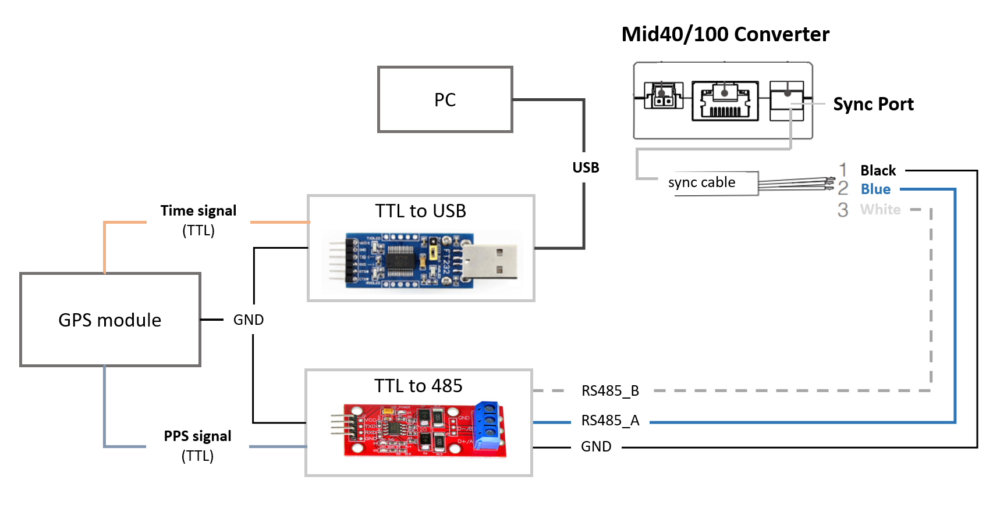
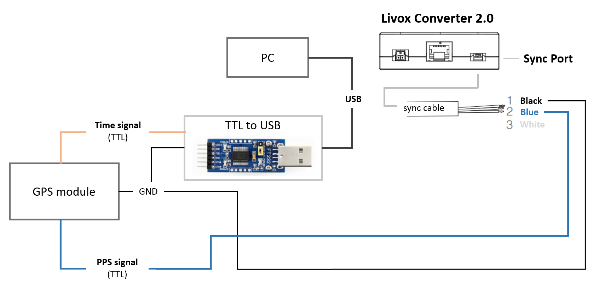

 

**Livox LiDAR Timestamp Synchronization**

| **Document   Release History** |             |                                      |
| ------------------------------ | ----------- | ------------------------------------ |
| **Date**                       | **Release** | **Change Description**               |
| 2019/6/19                      | v1.0.0      | Initial release                      |
| 2020/2/13                      | v1.1.0      | LiDAR add GPS synchronization method |
|                                |             |                                      |

[TOC]


# 1 Summary

| **Device**  | **Supported Time Synchronization Method**        |
| ----------- | ------------------------------------------------ |
| Livox LiDAR | 1. PTP v2<br>2. GPS<br>3. Pulse Per Second (PPS) |
| Livox Hub   | 1. PTP v2<br>2. GPS                              |

## 1.1 Application Scenarios

### PTP v2:

In the absence of GPS and PPS signals, PTP v2 can be used to synchronize time between Livox LiDAR/Hub and other devices. This method requires minimal external hardware environment and only requires a master clock supporting device in the whole network.

### PPS:

Livox LiDAR supports PPS time synchronization. PPS signal usually comes from GPS receiver. PPS signal generated by other devices such as MCU is also suitable. 

### GPS:

Livox Hub supports GPS time synchronization, which is recommended when integrating multiple LiDAR units via Livox Hub. Livox Hub needs the PPS and the time signal in GPRMC format from GPS receiver.

# 2 Usage

## 2.1 PTP v2

When Livox LiDAR or Livox Hub is connected to a network with master clock, the clock of  each LiDAR point cloud is automatically synchronized to the master clock. When PTP, PPS or GPS are available at the same time, PTP network synchronization is preferred.

### 2.1.1 Connection

Connect Livox LiDAR/Hub normally without additional wiring. 

### 2.1.2 Attention

Network environments with multiple master clocks are not supported. For the construction of master clock, please refer to Appendix [3.1 Set Up PTP Master Clock](#3.1).

### 2.1.3 Accuracy

Hundreds of nanoseconds

## 2.2 GPS

### 2.2.1 Livox Hub

#### 2.2.1.1 Connection

Connect the PPS signal and time stamp signal from GPS module to the Livox Hub's GPS sync port.


Remarks: 

- If the data output by the GPS module is 485 level, TTL to 485 module is not needed.

#### 2.2.1.2 Configuration

Do not require any software configuration when using Livox Hub for GPS time synchronization.

### 2.2.2 Mid40/100

#### 2.2.2.1 Connection

Connect the PPS signal from GPS module to the sync port of Mid40/100 converter, and connect the time stamp signal to PC through the TTL to USB module.



Remarks: If the data output by the GPS module is 485 level, the TTL to 485 module is not needed.

#### 2.2.2.2 Configuration

Mid firmware version: >= v03.07.0000, SDK version >= v2.0.0

**Use ROS driver**

- Connect the hardware according to the above block diagram;
- View the name of the port receiving "Time signal"(GPRMC/GNRMC) in PC system, such as `/dev/ttyUSB0`, configure "device_name" to this name in the file [livox_lidar_config.json](https://github.com/Livox-SDK/livox_ros_driver/blob/master/livox_ros_driver/config/livox_lidar_config.json), and set "enable_timesync" to `true`;
- Run the launch file;

**Use only SDK**

The link below is an example showing how to synchronize using only SDK:

[https://github.com/Livox-SDK/Livox-SDK/tree/master/sample_cc/lidar_utc_sync](https://github.com/Livox-SDK/Livox-SDK/tree/master/sample_cc/lidar_utc_sync)

### 2.2.3 Horizon

#### 2.2.3.1 Connection

Connect the PPS signal from GPS module to the sync port of Livox converter 2.0, and connect the time stamp signal to PC through TTL to USB module.



#### 2.2.3.2 Configuration

Horizon firmware version: >= v06.06.0000, SDK version >= v2.0.0

**Use ROS driver**

- Connect the hardware according to the above block diagram;
- View the name of the port receiving "Time signal"(GPRMC/GNRMC) in PC system, such as `/dev/ttyUSB0`, configure "device_name" to this name in the file [livox_lidar_config.json](https://github.com/Livox-SDK/livox_ros_driver/blob/master/livox_ros_driver/config/livox_lidar_config.json), and set "enable_timesync" to `true`;
- Run the launch file;

**Use only SDK**

The link below is an example showing how to synchronize using only SDK:

[https://github.com/Livox-SDK/Livox-SDK/tree/master/sample_cc/lidar_utc_sync](https://github.com/Livox-SDK/Livox-SDK/tree/master/sample_cc/lidar_utc_sync)

### 2.2.4 Attention

- Generally, when there is GPS satellite signal, the GPS module will have PPS signal and time signal output. In normal use, make sure the GPS satellite signal is stable.
- Make sure that the output of "Time signal" is standard GPRMC/GNRMC message.

### 2.2.5 Accuracy

1 microsecond

## 2.3 PPS

**Because the LiDAR has supported GPS synchronization, the PPS method is not recommended.**

Every time the LiDAR receives the rising edge of a pulse, the timestamp of point cloud will be reset to 0, and then the time will increase until the rising edge of the next pulse is received. We can use this feature to update the timestamp in each point cloud packet to the external GPS time.

Here is the pseudocode to achieve this synchronization:

```c
// GPS Time Synchronization
static uint64_t LiDAR_time_last;
static uint64_t LiDAR_time_real;

// 1. Read total second of the UTC time, Unit is second.
uint32_t gps_time_s = get_gps_utc_second();
// 2. Read LiDAR point time, Unit is nanosecond.
uint64_t LiDAR_time = get_LiDAR_pack_time();
// 3. Update real time.
if (LiDAR_time < LiDAR_time_last)
{
    //LiDAR time jump indicates the generation of GPS pulse.
    LiDAR_time_real = gps_time_s*(1e9) + LiDAR_time%(1000000000);
}
else
{
    LiDAR_time_real += LiDAR_time - LiDAR_time_last;
}
//Update history
LiDAR_time_last = LiDAR_time;
```

### 2.3.1 Connection

**Mid:**


**Horizon:**


### 2.3.2 Attention

- If the data output by the GPS module is 485 level, TTL to 485 module is not needed.

### 2.3.3 Accuracy

1 microsecond

# 3 Appendix

## 3.1 Set Up PTP Master Clock

Address: [https://github.com/ptpd/ptpd](https://github.com/ptpd/ptpd)

Download, compile and install:

```bash
git clone https://github.com/ptpd/ptpd.git
autoreconf -vi
./configure
make
make install
```

Modify the configuration file client-e2e-socket.conf in the test folder according to your needs. You can use the following configuration:

Add a network interface name, such as eth0:

```
; Network interface to use (required)
ptpengine:interface = eth0
```

Set the master clock function and set the parameters to masteronly:

```
; Options: none slaveonly masteronly masterslave 
ptpengine:preset = masteronly
```

Set clock_class to a value lower than 128:

```
; Clock class - announced in master state. Always 255 for slave-only mode.
; Minimum, maximum and default values are controlled by presets.
; If set to 13 (application specific time source), announced 
; time scale is always set to ARB. This setting controls the
; states a PTP port can be in. If below 128, port will only
; be in MASTER or PASSIVE states (master only). If above 127,
; port will be in MASTER or SLAVE states.
ptpengine:clock_class = 126
```

Then run the following command:

```bash
ptpd2 -c test/client-e2e-socket.conf
```

When a sync packet appears on the network, it indicates that the master clock of ptpd is successfully turned on.